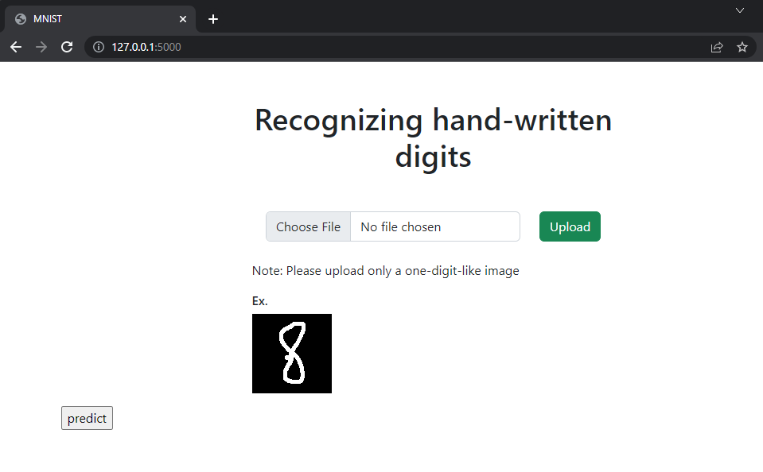

# Simple Machine learning app (MNIST)
The purpose of the project is to learn how to build a simple Machine Learning web Application.

## What are we going to do
We're going to create an ML web application that can recognize hand-written digits using the mnist dataset.

## Link dataset
https://www.kaggle.com/datasets/avnishnish/mnist-original

## Application Dependencies
- Flask
- Flask-Reuploaded
- Flask-WTF
- pillow
- numpy
- scipy
- scikit-learn

## How to do this
**Step 1:** Simply clone this repository
```
git clone 
```
**Step 2:** Get inside the project
```
cd simple-ML-mnist-local
```
**Step 3:** Create and activate the environment
```
conda create -n myenv python=3.9 -y
```
```
conda deactivate
```
```
conda activate myenv
```
If you didn't install python on your machine through conda
```
python -m venv venv
```
```
venv\Scripts\activate
```
**Step 4:** Install packages
```
python -m pip install --upgrade pip
```
```
pip install -r requirements.txt
```
**Step 5:** Run flask app
```
python main.py
```
**Step 6:** Point your browser to http://127.0.0.1:5000/  

## The result should look like this


**Step 7:** Upload image and HAVE FUN!